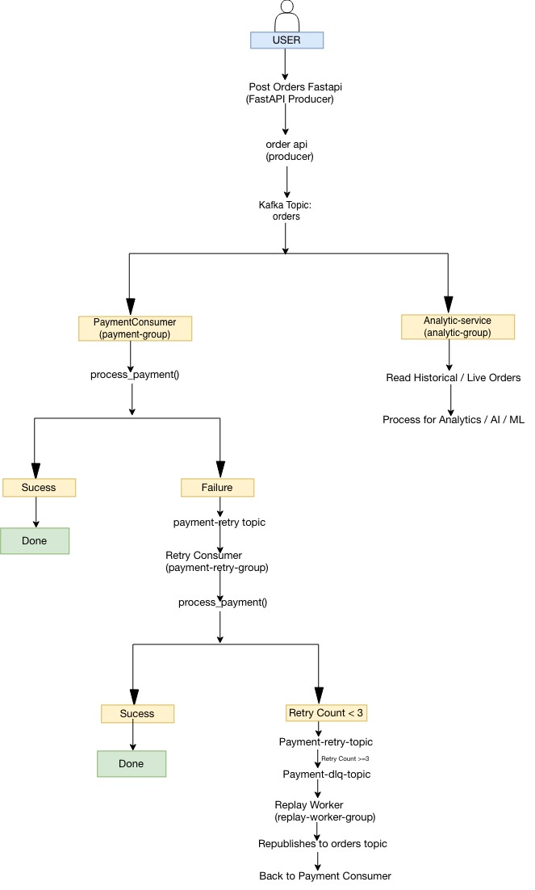
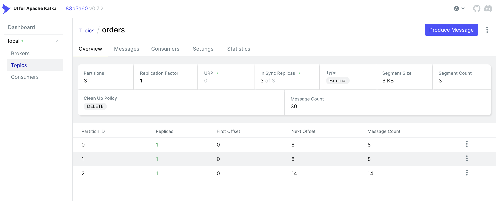
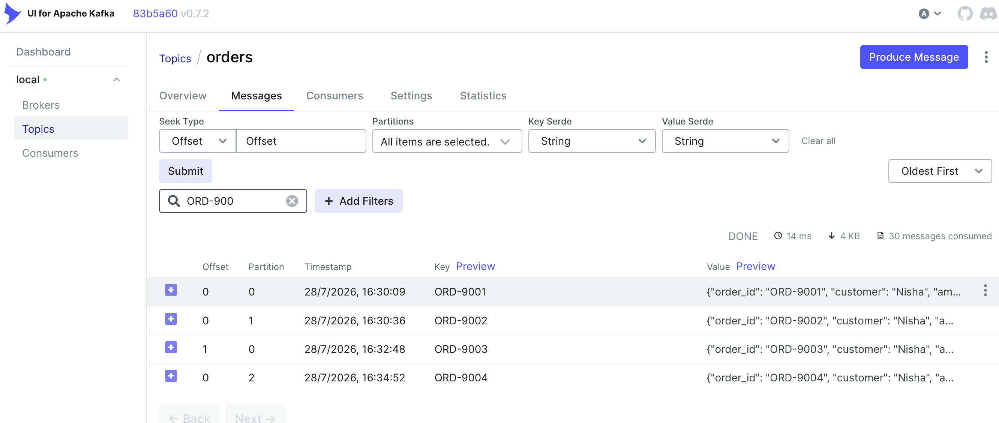
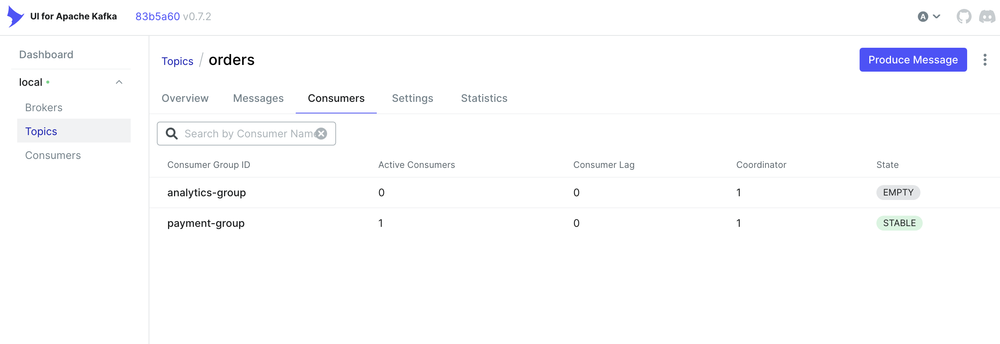

# Kafka Order Processing Demo

A production-inspired event-driven microservices project built with **Python**, **FastAPI**, **Apache Kafka**, and **Docker**.

## Overview

This project demonstrates how distributed services communicate asynchronously using Apache Kafka while handling failures through retry topics, Dead Letter Queues (DLQ), and replay workflows.

## Architecture



## Features

- FastAPI Order API
- Kafka Producer & Consumer
- Event-driven communication
- Consumer Groups
- Partitioning using `order_id`
- Retry Topic
- Dead Letter Queue (DLQ)
- Replay Worker
- Historical replay using new consumer groups
- Kafka UI integration
- Docker Compose setup

## Tech Stack

- Python 3.8+
- FastAPI
- Apache Kafka 4.x (KRaft)
- Confluent Kafka Python Client
- Docker & Docker Compose

## Running the Project

Start Kafka and Kafka UI

```bash
docker compose up -d
```

Start Order API

```bash
cd order-api
uvicorn app.main:app --reload --port 8001
```

Start Payment Service

```bash
cd payment-service
python -m app.main
```

Start Retry Consumer

```bash
python -m app.retry_consumer
```

Start Replay Worker

```bash
cd replay-worker
python -m app.main
```

Kafka UI

```
http://localhost:8080
```

## Kafka Concepts Demonstrated

- Event-driven architecture
- Topics & Partitions
- Consumer Groups
- Offset Management
- Retry Pattern
- Dead Letter Queue
- Replay Processing
- Historical Event Replay
- Partition Keys

## Kafka UI Screenshots

### Kafka | UI Overview


### Kafka | Topic: Orders - Messages


### Kafka | Consumer groups


## Order API 
** For Simulate Order retry and replay **
postman request POST 'http://127.0.0.1:8001/orders' \
  --header 'accept: application/json' \
  --header 'Content-Type: application/json' \
  --body '{
    "order_id":"ORD-9003",
    "customer":"Nisha",
    "amount":1200,
    "simulate_failure":true,
    "items":[
        {
            "product":"Keyboard",
            "quantity":1
        }
    ]
}'

** For Successful Order **
postman request POST 'http://127.0.0.1:8001/orders' \
  --header 'accept: application/json' \
  --header 'Content-Type: application/json' \
  --body '{
    "order_id":"ORD-9004",
    "customer":"MaNisha",
    "amount":5200,
    "simulate_failure":false,
    "items":[
        {
            "product":"MacBook",
            "quantity":1
        }
    ]
}'


## ⭐ Useful Commands

## 1️ List all topics

```bash
docker exec -it kafka /opt/kafka/bin/kafka-topics.sh \
  --bootstrap-server localhost:9092 \
  --list
```

---

## 2️ Describe a topic (Partitions, Leader, Replicas, ISR)

Replace `orders` with any topic name.

```bash
docker exec -it kafka /opt/kafka/bin/kafka-topics.sh \
  --bootstrap-server localhost:9092 \
  --describe \
  --topic orders
```

---

## 3️ Read messages with Offset and Key ⭐

This is my favourite debugging command.

```bash
docker exec -it kafka /opt/kafka/bin/kafka-console-consumer.sh \
  --bootstrap-server localhost:9092 \
  --topic orders \
  --from-beginning \
  --property print.offset=true \
  --property print.key=true
```

---

## 4️ Show Consumer Group details (Offset & Lag) ⭐⭐⭐

Replace `payment-group` with any consumer group.

```bash
docker exec -it kafka /opt/kafka/bin/kafka-consumer-groups.sh \
  --bootstrap-server localhost:9092 \
  --describe \
  --group payment-group
```

This shows:

* Current Offset
* Log End Offset
* Lag
* Consumer ID
* Host

---

## 5️ Show all Consumer Groups

```bash
docker exec -it kafka /opt/kafka/bin/kafka-consumer-groups.sh \
  --bootstrap-server localhost:9092 \
  --list
```

---


## 6 Create a topic

```bash
 docker exec -it kafka /opt/kafka/bin/kafka-topics.sh \
  --bootstrap-server localhost:9092 \
  --create \
  --topic orders \
  --partitions 3 \
  --replication-factor 1


 docker exec -it kafka /opt/kafka/bin/kafka-topics.sh \
  --bootstrap-server localhost:9092 \
  --create \
  --topic payment-retry \
  --partitions 3 \
  --replication-factor 1


  docker exec -it kafka /opt/kafka/bin/kafka-topics.sh \
  --bootstrap-server localhost:9092 \
  --create \
  --topic payment-dlq \
  --partitions 3 \
  --replication-factor 1
```

---

## 7 Read only Partition 0

```bash
docker exec -it kafka /opt/kafka/bin/kafka-console-consumer.sh \
  --bootstrap-server localhost:9092 \
  --topic orders \
  --partition 0 \
  --from-beginning \
  --property print.offset=true \
  --property print.key=true
```